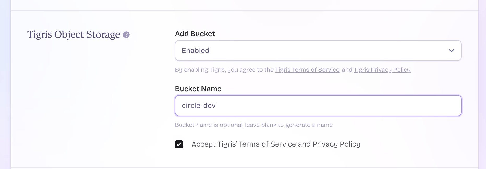
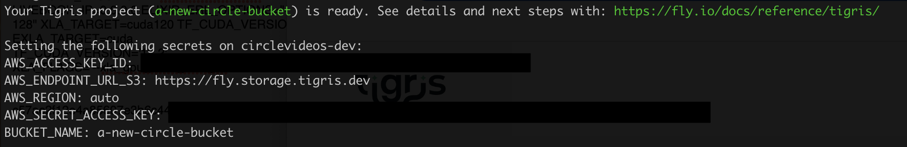

# Circle 

Related Article: **[Effortless Video Sharing with Phoenix LiveView and FLAME](https://www.poeticoding.com/effortless-video-sharing-with-phoenix-liveview-and-flame/)**

> Transparency Notice: The article is sponsored by [Tigris](https://www.tigrisdata.com). They've provided resources and compensation, enabling me to explore and share this solution. Tigris is featured for its excellent fit in this use case, chosen based on its merits. I'm really glad for their support in creating content about innovative technologies. I encourage readers to explore all services mentioned to find the best fit for their projects.

## Running it yourself

You first need a [fly.io](http://fly.io) account, with which you can also access to [Tigrisdata.com](https://www.tigrisdata.com).

1. To create the [fly.io](http://fly.io) app and the Tigris bucket is quite easy, you simply need to run the `fly launch` command in the root directory of the circle app. 
2. During the app creation you need to set the Tigris bucket you want to create, and fly will do the rest for you (like setting all secrets and most of the environment variables you need).

3. The Fly deployment will likely fail because you need to set the `FLY_API_TOKEN`, which is the token the app requires to spawn new machines for FFmpeg processing.

To resolve this, run the following command to generate a new token and set it in the app's secrets:

`fly secrets set FLY_API_TOKEN="$(fly auth token)"`

After setting the token, execute `fly deploy` to rebuild and launch the app.

4. Before uploading videos, you need to set the correct CORS settings for the bucket. In the Fly app dashboard, navigate to the *Tigris Object Storage menu* and click on your bucket. This will open a TigrisData web page where you can configure the bucket's settings.

Under Regions choose “Global”. I’ve also set a TTL to autodelete the files after a certain time. At the moment the app doesn’t support files auto-expire/deletion out of the box.

---

**Remember that, by default, anyone can access any page!** 
If you want to add basic protection to the upload page, you can set the `AUTH_USERNAME` and `AUTH_PASSWORD` env variables (set them as `fly secrets` ) to add basic authentication to the /videos/new route. It's a simple solution. While in production I'd prefer using accounts and LiveView sessions, this basic authentication should suffice for testing the app.